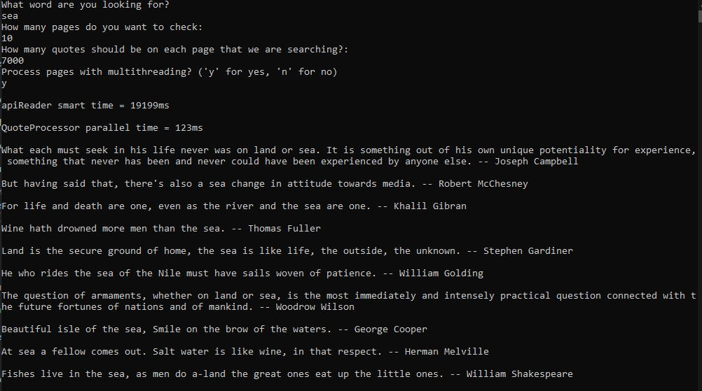

# QuoteFinder
This is a C# console application that will gather a collection of quotes per a given number of pages,(e.g. 10 pages 100 quotes per page) and then retrieve the shortest quote that contains a specific word from each page based on the users input. 
This data will then be displayed to the user. If no quote is found within the collection of quotes then "No quote found on this page" will be displayed. The API being used is the "Quote Garden" API.   
The purpose of this project was to practice the use of asynchronous methods, familiarize myself with the use of APIs, and further practice my overall C# coding skills.  
Additionally I strived to maintain strong organization, use clear and concise names for all classes, methods, variables, interfaces, etc. Even going as far as to use records and structs in certain cases.
One example of that being the use of a struct to minimize the amount of parameters within the GetUserInput method that, as the method name suggests, gathers user input.   
A user also has the option to decide whether or not to process the collection of quotes asynchronously or not. This is mainly done to demonstrate the performance boost achieved, with the use of TPL(Task Parallel Library), when retrieving and processing the collection of quotes.
The difference in speed is not truly seen until a large data set is used. With this in mind, I stress tested the application using 10 pages at 7000 quotes per page equaling 70,000 total quotes being processed. The maximum total quotes available from Quote Garden being 75,000. The word required to be contained within the quotes ("sea") was chosen arbitrarily. The results can be seen in the screenshots below. 

As seen below, the processing of quotes was completed in over half the time it took when processed without asynchrony. The test was performed multiple times having similar results with the use of asynchrony averaging around 120ms and without 320ms.
Similar performance increases were also observed when applying asynchrony to the method that retrieved the collection of quotes from the API. The time representing this is found in the screenshots as "api reader smart time". The original time it took to retireve the quotes from the API is not displayed but was also twice as long. 

## Final Note
During my practice and study of asynchronous methods, I found that while the use of asynchrony can be very beneficial in inhancing the performance of an application, other solutions for optimization, more times than not, come without the use of them.
### Quote processing with asynchrony - 123ms

### Quote processing without asynchrony - 330ms

